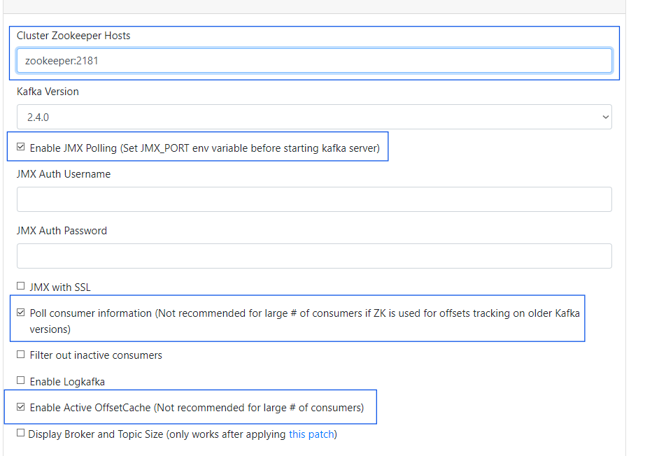

# CDC Pipeline Example with Database (PostgreSQL), CDC Streaming (Debezium + Kafka), Data-Lakehouse (Minio + Trino => hive & iceberg tables)  

An example CDC pipeline stack using PostgreSQL database as a data source to a Minio data lake house using Debezium & (Kafka + Zookeeper)  for CDC streaming, Minio for the data lake house storage and trino for the data lake house compute layer. The data will be streamed from PostgreSQL database into the Minio data lake as Hive tables in Parquet file format and  transformed into Iceberg tables (Also Parquet file format) using Trino as the SQL Engine.

# Tutorial used for creating this stack


# Prerequisites
-   Docker
-   Python 3.8 or higher

# Running CDC streaming from PostgreSQL into Kafka with Debezium connector
This section for setting up Kafka and Debezium to read data changes from the Postrges DB.

## Get start by running:
```
    docker compose up
```

### Once everything is up an running, follow the instructions below.

## Setup PgAdmin (To get a view into the DB)
Should be running on http://localhost:8000
-   username: admin@example.com
-   password: password
-   source_db_password: password (will be prompted after login)

The users table is already setup and initialzed when the container is started with some user records. More generated data will be ingested to see the streaming in action.

## Clusters + Topics Setup on Kafka Manager
Should be running on port http://localhost:9000

-   **Setup:**
    -   Click Add Cluster on top nav
    -   Enter zookeeper url and port: zookeeper:2181
    -   check JMX polling
    -   check Poll Consumer Information
    -   check Enable Active Offest Cache
    

-   **Optional:** - create a test topic to test sending and recieving messages
    -   Click on your created cluster
    -   Click on Topics on top nav
    -   Select create topic
    -   Enter a name and create

## Debezium Setup
Should be running on http://localhost:8083

Debezium does not have a GUI and thus will require sending an http request via postman, thunder client or any other method.

This step is to create the debezium connector for kafka which will read the transaction logs from the postgresql db and send it to kafka thus capturing the data changes in real time. 

-   **Connector Configuration:**   
    ```
        {
            "name": "source-db-connector",
            "config": {
                "connector.class": "io.debezium.connector.postgresql.PostgresConnector",
            "database.hostname": "<your-host-ip>",
                "database.port": "5432",
                "database.user": "postgres",
            "database.password": "password",
                "database.dbname": "source_db",
                "plugin.name": "pgoutput",
                "database.server.name": "source_db",
                "key.converter.schemas.enable": "false",
                "value.converter.schemas.enable": "false",
                "transforms": "unwrap",
                "transforms.unwrap.type": "io.debezium.transforms.ExtractNewRecordState",
                "value.converter": "org.apache.kafka.connect.json.JsonConverter",
                "key.converter": "org.apache.kafka.connect.json.JsonConverter",
            "table.include.list": "public.users",
                "slot.name" : "dbz_source_db_transactions_slot"
            }
        }
    ```

    **Note:** Must set your own host IP in the connector config.
    
    To get host ip, run ipconfig in your terminal and look for Ipv4Address.

-   **Request Details:**
    -   Method: POST
    -   Body(JSON): The connector config above.
    -   Url: http://localhost:8083/connectors
    

## Jupyter Notebooks for Testing Kakfa and Inserting generated data into DB

### Setup the python environment
    1. create a virtual env
        -   python -m venv .venv
    2. activate venv
        -   source .venv/bin/activate (or windows: .venv/Scripts/activate)
    3. install dependencies
        -   pip install -r jupyter-notebook-for-testing-kafka/requirements.txt

### Testing Kafka with Producers and Consumers
    Producing Messages:
    1. go into jupyer-notebook-for-testing-kafka/kafka-consumer.ipynb
    2. update the topic name in the code to the one created earlier in Kafka Manager
    3. run the code blocks to send a message

    Consuming Messages:
    1. go into jupyer-notebook-for-testing-kafka/kafka-consumer.ipynb
    2. update the topic name
    3. Run the code block that polls for messages

### Generating and Ingesting New User Records into DB


